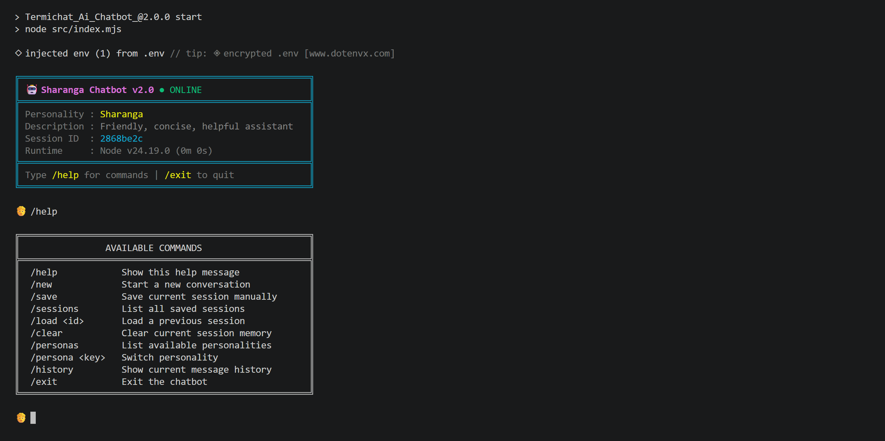
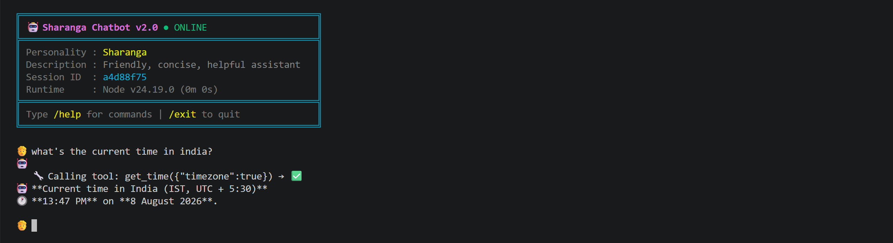
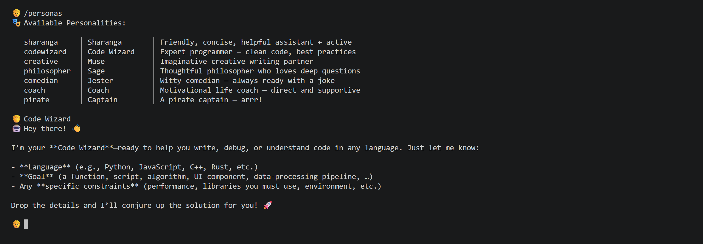

# 🤖 Termichat AI Chatbot

A terminal-based AI chatbot with **persistent memory**, **tool calling**, and **swappable personalities** — powered by the [Sharanga API](https://sharanga.cloud).

## ✨ Features

| Feature                  | Description                                                          |
| ------------------------ | -------------------------------------------------------------------- |
| 🧠 **Persistent Memory** | Conversations saved to disk. Resume any past session.                |
| 🔧 **Tool Calling**      | Bot can use tools: calculator, notes, dice, text analysis, and more. |
| 🎭 **Personalities**     | 7 built-in personas. Switch instantly. Add your own easily.          |
| 📡 **Streaming**         | Real-time token streaming for instant feedback.                      |

## 📸 Screenshots

### Chat in action



### Tool calling



### Switching personalities



## 🚀 Quick Start

```bash
git clone https://github.com/Krishna5601-Cpu/Termichat_Ai_Chatbot_.git
cd Termichat_Ai_Chatbot_
npm install
cp .env.example .env   # Add your Sharanga API key
npm start
```

## 🎭 Personalities

| Key           | Name        | Description                |
| ------------- | ----------- | -------------------------- |
| `sharanga`    | Sharanga    | Friendly, concise, helpful |
| `codewizard`  | Code Wizard | Expert programmer          |
| `creative`    | Muse        | Creative writing partner   |
| `philosopher` | Sage        | Deep philosophical thinker |
| `comedian`    | Jester      | Witty comedian             |
| `coach`       | Coach       | Motivational life coach    |
| `pirate`      | Captain     | Pirate captain 🏴‍☠️          |

Switch with: `/persona pirate`

## 🔧 Built-in Tools

The bot automatically calls these when needed:

- **get_time** — Current date/time
- **calculate** — Math expressions
- **save_note** — Save persistent notes
- **read_note** — Read saved notes
- **list_notes** — List all notes
- **delete_note** — Delete a note
- **random** — Dice roll, coin flip, random number
- **text_stats** — Word count, reading time, etc.

## 💬 Commands

| Command          | Description                        |
| ---------------- | ---------------------------------- |
| `/help`          | Show all commands                  |
| `/new`           | Start fresh conversation           |
| `/sessions`      | List saved sessions                |
| `/load <id>`     | Load a saved session               |
| `/save`          | Save current session               |
| `/clear`         | Clear memory (keeps system prompt) |
| `/personas`      | List personalities                 |
| `/persona <key>` | Switch personality                 |
| `/history`       | View message history               |
| `/exit`          | Save & exit                        |

## ➕ Adding Your Own

### Custom Personality

Edit `src/personalities.mjs`:

```js
export const personalities = {
  // ...existing ones...
  mybot: {
    name: "My Bot",
    description: "Does something cool",
    systemPrompt: "You are...",
  },
};
```

### Custom Tool

Edit `src/tools.mjs`:

```js
const tools = {
  // ...existing ones...
  my_tool: {
    definition: {
      type: "function",
      function: {
        name: "my_tool",
        description: "What it does",
        parameters: {
          type: "object",
          properties: {
            /* ... */
          },
          required: [
            /* ... */
          ],
        },
      },
    },
    handler: async (args) => {
      // Do something
      return "result string";
    },
  },
};
```

## 🧩 How It Works

`index.mjs` runs a terminal REPL that:

1. Streams the model's response token-by-token as you chat.
2. Detects tool calls in the stream, executes them via `executeTool`, and feeds results back to the model (up to 5 tool-call rounds per turn).
3. Persists every session to disk automatically after each turn and on exit.

## 📁 Data Storage

All data is stored locally in `data/` (gitignored):

```
data/
├── conversations/    # Saved chat sessions (.json)
└── notes/            # Saved notes (.md)
```

## 📜 License

MIT
